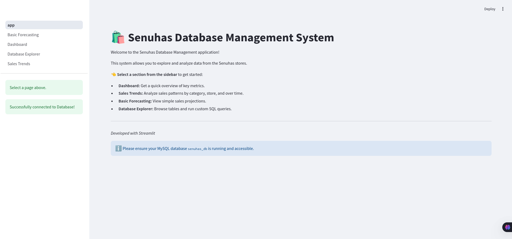
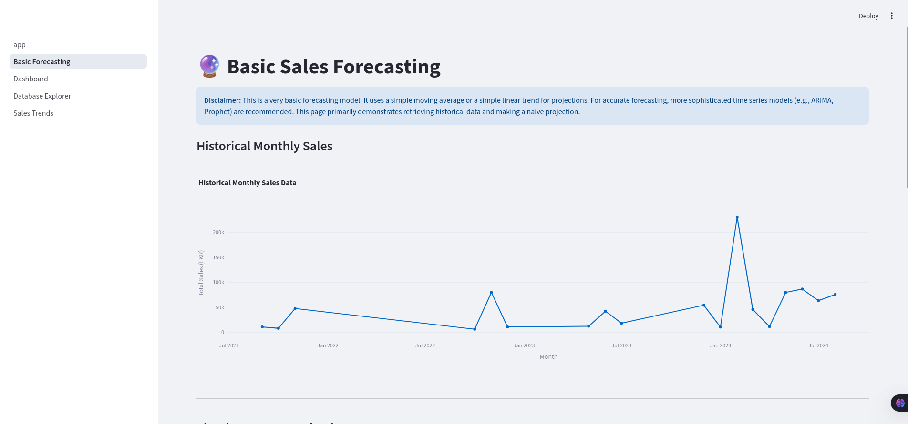
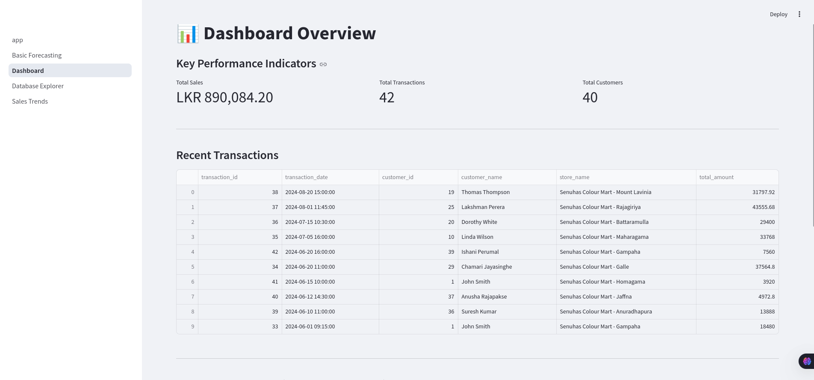
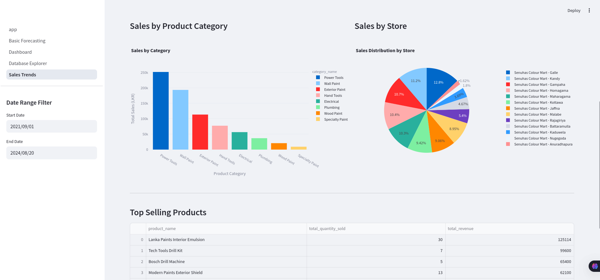

# Senuhas Database Management System

[](https://deepwiki.com/KSDeshappriya/senuhas-ADBMS)

A Streamlit-based web application for managing and analyzing data from Senuhas stores.



## 🚀 Features

- **Dashboard:** Quick overview of key metrics
- **Sales Trends:** Analysis of sales patterns by category, store, and time periods
- **Basic Forecasting:** Simple sales projections
- **Database Explorer:** Browse tables and run custom SQL queries

## 📦 Installation

1. Clone this repository:

   ```bash
   git clone https://github.com/KSDeshappriya/senuhas-ADBMS.git
   cd senuhas-ADBMS
   ```
2. Create and activate a virtual environment (optional but recommended):

   ```bash
   python -m venv venv
   source venv/bin/activate  # On Windows: venv\Scripts\activate
   ```
3. Install the required packages:

   ```bash
   pip install -r requirements.txt
   ```
4. Configure your database connection (see Configuration section)

## 🔧 Configuration

Create a `db_config.py` file in the root directory with your MySQL database connection details:

```python
DB_CONFIG = {
    "host": "localhost",
    "user": "your_username",
    "password": "your_password",
    "database": "senuhas_db"
}
```

Alternatively, you can initialize your database using the provided script:

```bash
python db/init_db.py --host localhost --user root --password password --database senuhas_db
```

This will set up the necessary tables and populate them with sample data.

## 📋 Requirements

- Python 3.7+
- MySQL Server
- Required Python packages:
    - streamlit
    - protobuf==3.20.0
    - mysql-connector-python
    - pandas
    - plotly
    - numpy # For basic forecasting
    - argparse

## 🏃‍♂️ Running the Application

Start the Streamlit server:

```bash
streamlit run app.py
```

The application will be available at http://localhost:8501 by default.

## 📁 Project Structure

```
streamlit-senuhas/
├── app.py                # Main application entry point
├── database.py           # Database connection and query functions
├── db_config.py          # Database configuration (create this file)
├── db/                         # Database scripts
│   └── init_db.py        # Script to initialize and populate the database
│   ├── schema/                 # Schema definition scripts
│   │   ├── create_tables_mysql.sql
│   │   ├── views_mysql.sql
│   │   ├── procedures_mysql.sql
│   │   ├── functions_mysql.sql
│   │   └── triggers_mysql.sql
│   └── data/                   # Sample data and migrations
│       └── sample_data.sql
├── pages/                # Streamlit pages for different sections
│   ├── Dashboard.py   # Dashboard page
│   ├── Sales_Trends.py
│   ├── Basic_Forecasting.py
│   └── Database_Explorer.py
├── requirements.txt      # Python dependencies
└── README.md             # This file
```

## Demo






## 📊 Database Schema

The application expects a MySQL database named `senuhas_db` with tables for:

- Products
- Categories
- Sales
- Stores
- Inventory
- etc...

You can create these tables manually or use the initialization script `db/init_db.py` to set them up automatically.

## 🔍 Development

To add new pages:

1. Create a new Python file in the `pages/` directory
2. The filename should start with a number for proper ordering (e.g., `05_New_Page.py`)
3. Use Streamlit components to build your page

## 📝 License

MIT

## 👥 Contributors

- Kavindu Shehan - Initial development

---

*Built with Streamlit and ❤️*
